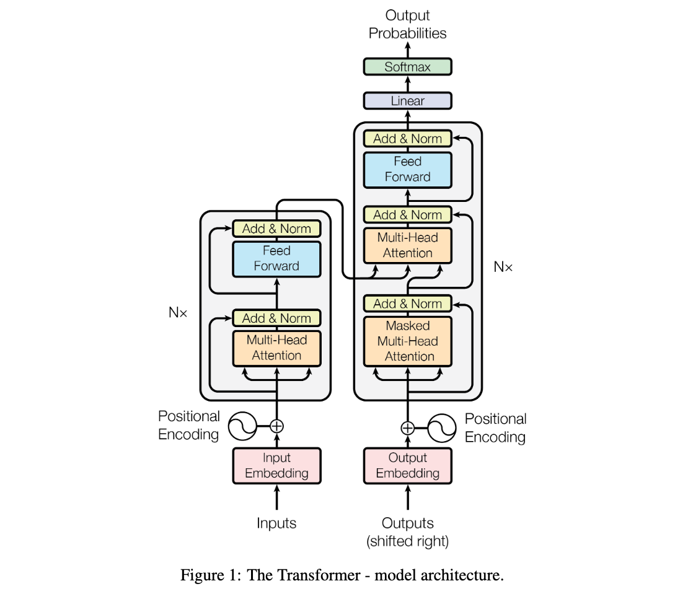
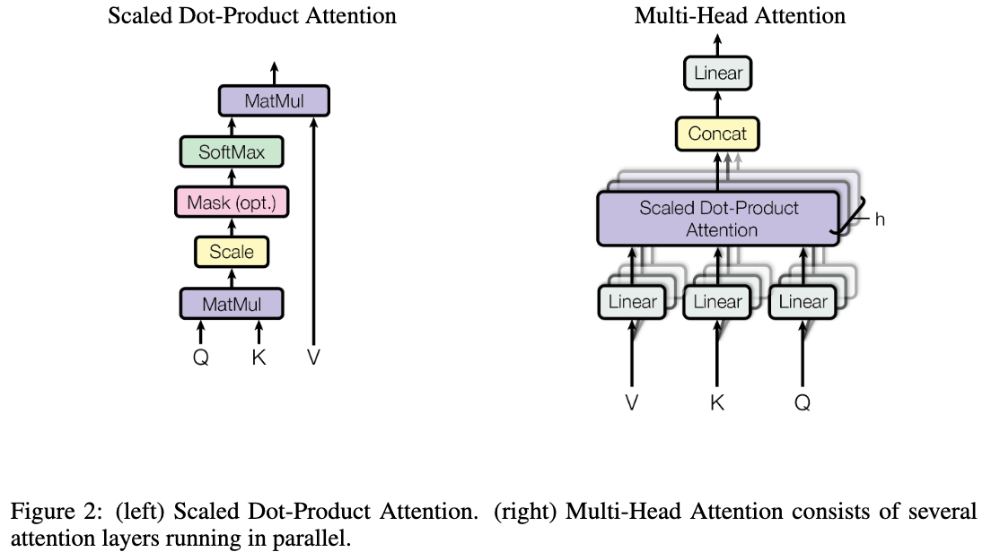

# Attention is all you need

## 1 Introduction

循环神经网络（RNN），尤其是长短期记忆网络（LSTM）和门控循环神经网络（GRU），在序列建模与转换任务（如语言建模和机器翻译）中已被确立为最先进的方法。后续研究持续推动循环语言模型及编码器-解码器架构的性能边界。这类循环模型通常沿着输入输出序列的符号位置进行因子分解计算，通过将符号位置与计算时间步对齐，生成由前序隐藏状态hₜ₋₁和当前位置t输入共同决定的隐藏状态序列hₜ。**这种固有的序列化特性导致训练样本内部无法实现并行计算**，当处理长序列时，内存限制进一步制约了跨样本的批处理能力。近期研究通过因子分解技巧和条件计算显著提升了计算效率，后者同时提升了模型性能。然而，序列化计算的根本性限制依然存在。

注意力机制已成为多领域序列建模与转换模型的核心组件，其优势在于能够建模输入或输出序列中任意距离的依赖关系。但除少数特例外，现有注意力机制通常与循环网络结合使用。本研究提出Transformer架构，该模型摒弃循环结构，**完全依赖注意力机制建立输入与输出间的全局依赖关系**。相较于传统架构，Transformer实现了更高程度的计算并行化，在八块P100图形处理器上仅需12小时训练即可达到机器翻译质量的新技术标杆。

## 2 Background

【架构演进与技术突破】 降低序列计算复杂度的目标同样是Extended Neural GPU、ByteNet与ConvS2S等模型的核心设计原则，这些架构均以卷积神经网络为基础构建模块，能够对所有输入及输出位置进行并行化的隐层表征计算。然而此类模型中，关联两个任意输入/输出位置信号所需的计算量随位置间距增长而增加（ConvS2S呈线性增长，ByteNet呈对数增长），导致远距离位置间依赖关系的学习难度显著提升。

【Transformer的革新特性】 Transformer架构通过自注意力机制将**此计算量降至常数级别**，尽管因注意力权重位置的平均化处理会降低有效分辨率，但通过3.2节所述的多头注意力机制可有效缓解该问题。自注意力（亦称内部注意力）是一种通过关联单一序列内不同位置来计算序列表征的机制，已成功应用于阅读理解、抽象摘要、文本蕴含及任务无关的句子表征学习等多个领域。

【对比研究与创新价值】 端到端记忆网络虽采用基于循环注意力机制的非序列对齐架构，但其主要验证场景局限于简单语言问答及语言建模任务。据现有文献考证，**Transformer是首个完全依赖自注意力机制、摒弃序列对齐循环神经网络或卷积操作来实现输入输出表征计算的转换模型**。后续章节将系统阐述Transformer架构原理，深入解析自注意力机制相较于既有模型的优势，并对其超越ConvS2S、ByteNet等经典方案的技术路径进行论证。

## 3 Model Architecture

当前最具竞争力的神经序列转换模型普遍采用编码器-解码器结构。在此框架中，编码器将输入符号序列$(x₁,…,xₙ)$映射为连续表征序列 $z=(z₁,…,zₙ)$；解码器基于z逐步生成输出符号序列 $(y₁,…,yₘ)$，其生成过程具有严格的自回归特性——即在每个时间步生成新符号时，均将已生成符号作为

### 3.1 Encoder and Decoder Stacks

**编码器架构**深度解析

1. 层级堆叠结构
   - 由N=6个结构完全相同的层级模块堆叠构成
   - 每个层级包含两个核心子层：
     - 多头自注意力机制（Multi-Head Self-Attention）
     - 位置感知全连接前馈网络（Position-wise FFN）
2. 残差学习框架
   - 每个子层采用残差连接范式：输出 = $\text{LayerNorm(x + Sublayer(x))}$
   - Sublayer(x) 表示子层自身的变换函数
   - 全网络维度一致性：嵌入层与所有子层输出维度保持$$d_{model}=512$$
3. 归一化策略
   - 每个残差连接后执行层归一化操作
   - 确保梯度传播稳定性，加速模型收敛

**解码器**架构创新设计

1. 扩展型三子层结构
   - 在编码器双模块基础上新增：
     - 编码器-解码器注意力层（Encoder-Decoder Attention）
   - 通过交叉注意力机制实现源-目标序列对齐
2. 自注意力掩码机制
   - 解码器自注意力层引入单向掩码
   - 禁止当前位置访问后续位置信息
   - 结合输出嵌入右移一位的位置偏移策略，保证自回归特性
3. 维度一致性保障
   - 继承编码器的残差连接架构
   - 所有子层输出维度维持$d_{model}=512$不变
   - 层级间梯度流通过层归一化优化

### 3.2 Attention

注意力函数可形式化描述为将一组查询向量与键值对集合映射至输出向量的过程，其中查询向量、键向量、值向量及输出向量均为多维向量空间中的数学实体。该函数的计算机制可归结为：输出向量由所有值向量的加权和构成，而各值向量的权重系数通过查询向量与对应键向量之间的相容性函数动态生成。

#### 3.2.1 Scaled Dot-Product Attention

我们将提出的注意力机制命名为「缩放点积注意力」（如图2所示）。该机制的输入包含维度为$d_k$的查询向量和键向量，以及维度为$d_v$的值向量。其计算流程为：首先计算查询向量与所有键向量的点积，将每个结果除以$\sqrt{d_k}$进行缩放，再通过softmax函数生成值向量的权重分布。实际应用中，我们采用矩阵化并行计算，将多个查询向量整合为矩阵$Q$，键与值向量分别整合为矩阵$K$和$V$，最终输出矩阵的计算公式为：   $$\text{Attention}(Q, K, V) = \text{softmax}\left( \frac{QK^T}{\sqrt{d_k}} \right)V \quad (1)$$    

当前主流注意力函数可分为加法注意力与点积注意力两类。点积注意力机制与本文算法核心一致，仅缺少$\frac{1}{\sqrt{d_k}}$的缩放因子；而加法注意力则通过单隐藏层前馈网络计算相容性函数。尽管二者理论复杂度相近，但**点积注意力因可利用高度优化的矩阵乘法实现，在实际应用中展现出显著的速度优势与内存效率**。实验表明，当$d_k$较小时两种机制性能相当，但在$d_k$增大时未缩放的点积注意力性能劣于加法注意力。我们推测这是因为$d_k$较大时点积结果量级膨胀，导致softmax函数进入梯度饱和区域。**为消除此效应，引入$\sqrt{d_k}$作为缩放因子。**  

#### 3.2.2 Multi-Head Attention

▍核心架构设计原理 
针对传统单头注意力机制的局限性，本文提出多头注意力（Multi-Head Attention）的改进方案：  
$$
\text{MultiHead(Q,K,V)}=\text{Concat}(head_1,...,head_h)W^O
$$

1. 线性投影分解 
   对原始$d_{model}$维的查询、键、值向量分别进行$h$次可学习的线性投影变换，生成维度为$d_k$（查询/键）与$d_v$（值）的多个子空间表征。数学表达为：  

   $$\text{head}_i = \text{Attention}(QW_i^Q, KW_i^K, VW_i^V)$$  

   其中投影矩阵$W_i^Q, W_i^K \in \mathbb{R}^{d_{model} \times d_k}$，$W_i^V \in \mathbb{R}^{d_{model} \times d_v}$  

2. 并行注意力计算  
   $h$个独立注意力头同步执行计算，每个头输出$d_v$维向量。最终通过拼接（Concat）和二次投影矩阵$W^O \in \mathbb{R}^{hd_v \times d_{model}}$整合为最终输出  

▍工程实现参数配置  
- 并行头数量：设定$h=8$个并行注意力层  
- 维度压缩策略：各头维度降为$d_k = d_v = d_{model}/h = 64$  
- 计算复杂度平衡：总计算量与全维单头注意力相近（单头计算量：$d_{model}^2$；多头计算量：$h \cdot (d_{model}/h)^2 = d_{model}^2/h$）

#### 3.2.3 Applications of Attention in our Model

Transformer模型通过以下三种方式运用多头注意力机制：

1. **编码器-解码器注意力层**：查询向量来自解码器前一层的输出，键/值向量来自编码器的最终输出。该机制使解码器每个位置均可关注输入序列的全部位置，其功能等效于经典序列到序列模型中的跨模态注意力对齐。
2. **编码器自注意力层**：键、值、查询向量均源自编码器前一层输出。编码器各位置可通过自注意力机制捕获前层所有位置的信息依赖。
3. **解码器自注意力层**：解码器各位置仅可关注该位置之前（含当前位置）的输出序列。为保持自回归特性，采用掩码技术屏蔽未来位置信息——在缩放点积注意力计算中，将softmax输入矩阵的非法连接位置设为负无穷大（如图2所示）。

### 3.3 Position-wise Feed-Forward Networks

除注意力子层外，编码器与解码器的各层均包含全连接前馈网络。该网络对每个位置的向量进行独立且一致的运算，其结构由两个线性变换层与中间的ReLU激活函数构成：   $$\text{FFN}(x) = \max(0, xW_1 + b_1)W_2 + b_2 \quad (2)$$   

各位置使用的线性变换参数相同，但不同层级间的参数独立。该结构亦可理解为两次核尺寸为1的卷积操作。网络输入输出维度保持$d_{model}=512$，中间层维度扩展至$d_{ff}=2048$。  

### 3.4 Embeddings and Softmax

 与传统序列转换模型一致，本文采用可学习的嵌入层将输入符号与输出符号映射至$d_{model}$维向量空间。同时，通过标准线性变换层与softmax函数将解码器输出转换为下一符号预测概率。模型设计中，输入/输出嵌入层与softmax前的线性变换层共享权重矩阵，并在嵌入层中将权重参数统一缩放$\sqrt{d_{model}}$倍。  

### 3.5 Positional Encoding

 由于本模型未采用循环或卷积结构，为赋予模型感知序列顺序的能力，需向编码器与解码器底部的输入嵌入中添加位置编码信息。位置编码维度与词嵌入维度保持$d_{model}$一致，以便直接进行向量相加。位置编码可采用可学习参数或固定函数生成[9]，本文选用不同频率的正弦/余弦函数组合：   
$$
 \begin{aligned} PE_{(pos,2i)} &= \sin\left(pos / 10000^{2i/d_{model}}\right) \\ PE_{(pos,2i+1)} &= \cos\left(pos / 10000^{2i/d_{model}}\right) \end{aligned}
$$
其中$pos$表示序列位置，$i$为维度索引。每个维度对应一个波长呈几何级数分布（范围$2\pi$至$10000\cdot2\pi$）的正弦曲线。选择此函数基于其相对位置线性表征特性：对于任意固定偏移量$k$，$PE_{pos+k}$可表示为$PE_{pos}$的线性变换。实验表明学习式位置编码[9]与本文方法性能相当，但**正弦编码方案能使模型外推至比训练序列更长的输入**。  

## 4 Why Self-Attention

 本节从三个核心维度系统比较自注意力层与序列建模中常用的循环层、卷积层的特性差异。研究对象为将符号表征序列$(x_1,...,x_n)$映射为等长序列$(z_1,...,z_n)$的典型架构，其中$x_i,z_i \in \mathbb{R}^d$（如编解码器中的隐藏层）。评估自注意力机制时聚焦以下关键指标：  

核心对比维度 
1. 单层计算复杂度  
   自注意力层通过$\mathcal{O}(1)$级顺序操作连接全位置，而循环层需$\mathcal{O}(n)$顺序操作。当序列长度$n$小于表征维度$d$时，自注意力计算效率显著优于循环层。  

2. 可并行化计算量  
   自注意力机制通过矩阵运算实现全位置并行处理，其最小顺序操作数恒定。相比之下，循环层必须按时间步逐步计算，产生$\mathcal{O}(n)$级顺序依赖。  

3. 长程依赖路径长度  
   自注意力层任意两位置间最大路径长度为$\mathcal{O}(1)$，而循环层需$\mathcal{O}(n)$级路径，卷积架构（连续核需$\mathcal{O}(n/k)$层，空洞卷积需$\mathcal{O}(\log_k n)$层）路径更长。短路径特性使自注意力更易捕获长程依赖。  

扩展优化方案 
- 长序列计算优化：限制自注意力感受野为半径$r$的局部邻域，将最大路径长度增至$\mathcal{O}(n/r)$（待后续研究验证）  
- 卷积架构对比：标准卷积层计算代价是循环层的$k$倍，但可分离卷积将复杂度降至$\mathcal{O}(k·n·d + n·d^2)$。当$k=n$时，其复杂度等价于自注意力+点向全连接层的组合方案。  

模型可解释性优势 
自注意力权重分布具有显式的语义解释价值（详见附录案例）：
- 多任务分化：不同注意力头自发学习句法依存分析、语义角色标注等差异化任务  
- 结构关联性：注意力模式与句子的语法树、语义框架呈现强相关性  

（关键参数对照表）  
| 层类型         | 最大路径长度 | 序列操作复杂度 | 典型应用场景          |  
|----------------|--------------|----------------|-----------------------|  
| 自注意力层     | $\mathcal{O}(1)$ | $\mathcal{O}(n^2 \cdot d)$ | 短中序列建模          |  
| 循环层         | $\mathcal{O}(n)$ | $\mathcal{O}(n \cdot d^2)$ | 实时流式处理          |  
| 连续卷积堆叠   | $\mathcal{O}(\log_k n)$ | $\mathcal{O}(k \cdot n \cdot d^2)$ | 局部特征提取          |  
| 空洞卷积       | $\mathcal{O}(n/k)$ | $\mathcal{O}(k \cdot n \cdot d^2)$ | 长程模式识别          |  

（说明：复杂度计算基于$d$为隐藏层维度，$k$为卷积核尺寸，$n$为序列长度的标准假设）