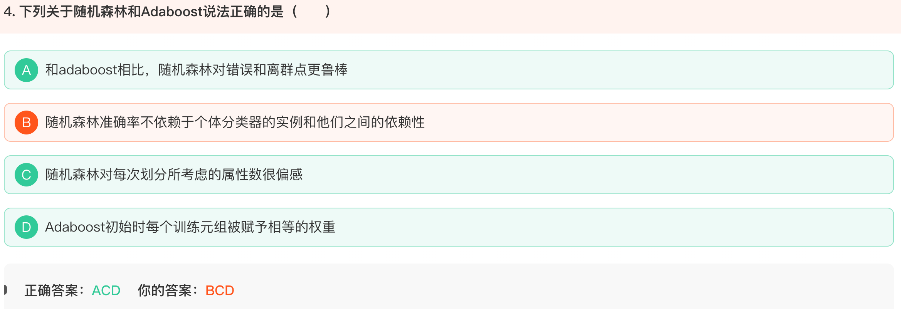
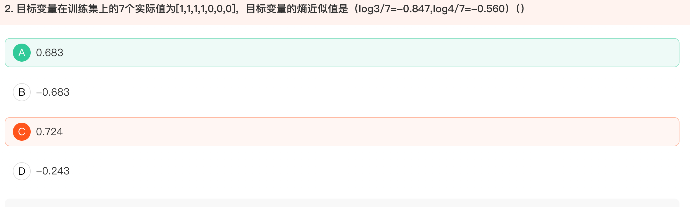

## 离散化方法

## 生成式模型

> 生成模型，就是生成(数据的分布)的模型；生成式模型通过学习数据的生成过程来预测目标变量。例如，它可以生成与训练数据相似的新数据样本。它通常会假设数据符合某种概率分布（如高斯分布、多项分布等），然后通过最大似然估计等方法来估计模型参数。
>
> 判别模型，就是判别(数据输出量)的模型。判别式模型直接从输入特征到目标变量的映射关系进行建模，通常通过最小化预测值和真实值之间的误差来训练模型。它不关心数据是如何生成的，只关注如何根据输入特征准确地预测目标变量。
>
> 生成式模型：
>
> 朴素贝叶斯、混合高斯模型、隐马尔科夫模型(HMM)、贝叶斯网络、Sigmoid Belief Networks
>
> 马尔科夫随机场(Markov Random Fields)、深度信念网络(DBN)
>
> 判别式模型：
>
> K近邻(KNN)、线性回归(Linear Regression)、逻辑斯蒂回归(Logistic Regression)、神经网络(NN)
>
> 支持向量机(SVM)、高斯过程(Gaussian Process)、条件随机场(CRF)、CART(Classification and Regression Tree)

## 集成学习

### 随机森林、Adaboost、GBDT

### 信息熵

> 在信息熵的计算中,该问题给出了目标变量在训练集上的7个实际值[1,1,1,1,0,0,0],根据信息熵的公式:H = -P(1)log₂P(1) - P(0)log₂P(0)
>
> 具体计算步骤如下:
>
> 1. P(1) = 4/7, P(0) = 3/7
> 2. 代入熵的计算公式:  H = -(4/7)×log₂(4/7) - (3/7)×log₂(3/7)
>
> 3. 题目给出log(3/7)=-0.847, log(4/7)=-0.560
> 4. 所以H = -(4/7)×(-0.560) - (3/7)×(-0.847) = 0.320 + 0.363 = 0.683
>
> 这个计算结果验证了信息熵的特性:当样本分布越均匀时,熵值越大;当样本完全相同时,熵值为0。在这个例子中,正反例比例接近(4:3),所以熵值相对较大。

## 